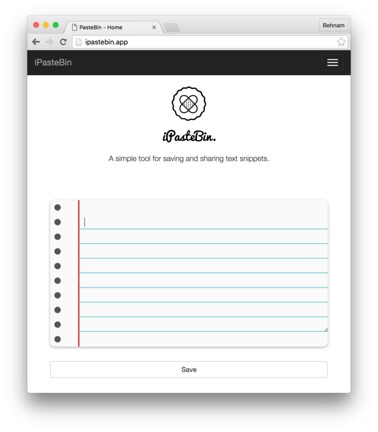

[iPasteBin](https://behnum.github.io/iPasteBin/) is another simple paste tool based on the Laravel Framework. The project emerged as an incentive for me to engage with open-source software and enhance my front and back-end skills. While it is still at its primitive level, it can handle the following tasks:

1. Provide the visitor with a large input box.
2. Save the snippet to the database.
3. Redirect the user to a custom URI to share their note.

There is, of course, a lot to be done, but for now, I think it is a good starting point.

You can check it out at: [behnum.github.io/iPasteBin/](https://behnum.github.io/iPasteBin/)
